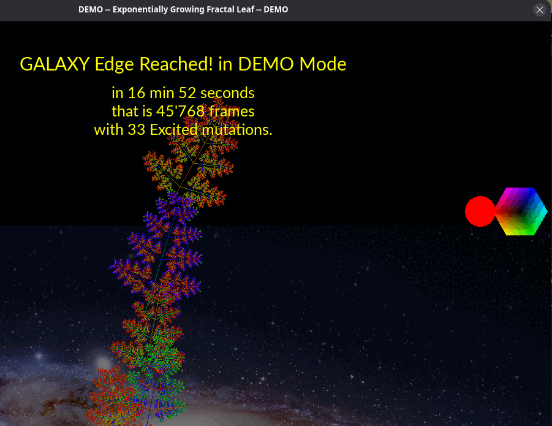

# fractal-grow
**Exponentially Growing Fractal Leaf — Animation, Game**

# Principle
Elements of a leaf-shaped fractal are drawn recursively by applying a defined transformation that turns the largest element into progressively smaller ones.
However, from time to time, one of the existing elements undergoes a spontaneous *mutation*. It begins to gradually grow, along with all of its subordinate elements. This creates — or rather modifies — a branch, which ends up usually larger than its predecessor.
After a short time, the mutation process repeats itself within the already mutated branch.

As a result, the fractal structure grows upward exponentially, and the frame rescales to cover more and more area. The structure starts from 24 cm, which is roughly the initial structure size on the screen.
After about 30 minutes of self-perpetuating *Animation*, the fractal reaches the size of the Milky Way Galaxy. More precisely, when the animation is finished, it covers the distance from Earth to the *Edge of the Galaxy*. That time, however, may be shortened by user actions — and here is where the *Game* part comes into play...

# Game
If, during the mutated growing phase, the stem *catches* light rays of a similar color, that stem becomes *Excited* (super-charged). It will then extend its size even further and faster.
Catching light happens when light rays (illustrated when the light source is in motion) cross perpendicularly to the stem axis. This is indicated by the stem color turning white.
It is up to the player to manipulate the light source while the fractal structure is growing. This is done using the arrow keys.

Since a stem usually has different colors on its two ends, the intermediate color matters. This is represented by a color flag pointing to the middle of the stem.

# ⌨ Keyboard Actions
The light source, and thus the game, is controlled by the arrow keys (or WASD keys).  
The horizontal arrows rotate the color, and the vertical arrows move the light source.

Below is a complete list of key functions:

| Key          | Function                                         |
| ------------ | ------------------------------------------------ |
| F1           | Help                                             |
|              |                                                  |
| ↑ Up or W    | Move light source up                             |
| ↓ Down or S  | Move light source down                           |
| ← Left or A  | Rotate light color                               |
| → Right or D | Rotate light color (reversed)                    |
|              |                                                  |
| F3           | Load next initial configuration from config file |
|              |                                                  |
| Space        | Pause / Freeze mutation animation                |
| Enter        | Resume mutations                                 |
| R            | Reset                                            |
| X            | Exit                                             |
|              |                                                  |
| L            | Toggle light on/off                              |
| G            | Switch grid ray visualization mode               |
|              |                                                  |
| Page Up      | Speed up drawing (less detail)                   |
| Page Down    | Slow down drawing (more detail)                  |

# Preceding Project

This project is based on [fractal-anim](https://github.com/aKermit21/fractal-anim.git) by the same author. Both can use the same initial configuration file(s). (In fact, the previous project was used to design the initial fractal leaf shapes and colors.)

# Installation
## Dependencies
- **SFML** (sfml-graphics) — to be installed *manually* beforehand (see [sfml website](https://www.sfml-dev.org/))
- lyra (C++ arg parser) — embedded as a subproject (see [original lyra source](https://github.com/bfgroup/Lyra))
- tomlplusplus — embedded as a subproject (also available through package managers)

## Get the Project
Clone the GitHub project:
```shell
git clone https://github.com/aKermit21/fractal-grow.git
```

## Compilation
The procedure below was tested on Linux.
It is recommended to use the Meson build system, as it verifies dependencies, handles subprojects, enables automatic configuration, and supports explicit installation.

```shell
cd fractal-grow
mkdir build-release/
meson setup build-release/
cd build-release/
meson compile
./exfra [-h]   # to run the app directly from the build directory
```

## Optional: Explicit Installation of Program, Dependent Libraries, and Files in the System
```shell
meson configure --prefix=$HOME/.local   # optionally, for Linux LOCAL installation
meson install
```
Manually copy the other images (`../image/*.jpg`) to the same location where the `Galaxy.jpg` file was copied.

To install the toml++ shared library in the system (which will NOT be installed automatically as a subproject):

### Use a Package Manager
For example, with pacman:
```shell
sudo pacman -S tomlplusplus
```

### Perform a Custom Build
One can also build and install it manually:

```shell
cd ../subprojects/tomlplusplus-3.4.0
mkdir build-lib/
meson setup build-lib/
cd build-lib/
meson install
[sudo ldconfig]   # update library cache
exfra [-h]     # now shall run from any location
```
Note that adding a custom library path may then be needed.

## Running

To check available options:
```shell
[./]exfra --help
```

It might be worth trying the demo:
```shell
[./]exfra --demo
```

Press F1 at runtime to display available key actions.

## Modification and Adaptation

To modify and test changed code, it is recommended to use a separate build directory (e.g., `build-dev/`) containing a modified build settings instance:

```shell
meson setup build-dev/
cd build-dev/
meson configure --buildtype=custom --optimization=2
```
This will enable assertions and extensive logging.

# Screenshots



